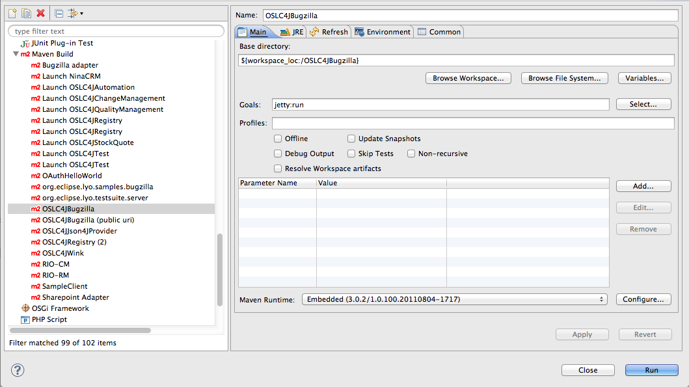

# Sample OSLC Bugzilla application

This application is an example of what Eclipse Lyo can be used for, in the form of an OSLC-CM compatible adapter for the Bugzilla bugtracker application. It wraps Bugzilla (interacting with it through Bugzilla's native XMLRPC API) with an OSLC-CM provider server accessible through REST calls.

This application uses the [OSLC4J] SDK to build up the adapter from Plain Old Java Objects and relatively simple JAX-RS web services.

## Getting started

1. Sign up for the Bugzilla landfill account: https://landfill.bugzilla.org/bugzilla-4.4-branch/
1. Run the adaptor: `mvn clean jetty:run-exploded`. **If you run with `jetty:run` only, the container will silently fail to load.***
1. Navigate to http://localhost:8080/BugzillaAdaptor/
1. Use your Landfill credentials to log into the adaptor. It will pass them to the Landfill server (as specified in `test/resources/bugz.properties`).

### Using the hosted Bugzilla adapter

We've recently hosted the Lyo Bugzilla adapter at [<https://oslc-bugzilla.mybluemix.net/>] This server is provided as-is and may go down at any time. It connects to the [Bugzilla Landfill (4.2-branch)]

## Building and Running the Lyo Bugzilla Sample in Eclipse

You can also build and run the Bugzilla adapter locally.

### Prerequisites

See [Lyo/prereqs].

### Clone the Lyo Docs Git repository

The code resides in the Lyo docs repository since it is part of the [OSLC Lyo Workshop].

This example assumes EGit is being used to download the code.

-   Open the Git Repositories view in Eclipse and click the Clone Git Repository icon
-   Use [lyo.docs] as the URI (browse it also [on line]). User/Password are not required.
-   On the Branch Selection page, select the master branch
-   On the Local Destination page, specify a location or accept the default and click Finish

The repository should now show up in your Git Repositories view.

### Import Eclipse projects from the Git repositories

-   In the Git Repositories view, right click org.eclipse.lyo.docs and select Import Projects
-   Select the Import Existing Projects wizard and click Next
-   Import org.eclipse.lyo.oslc4j.bugzilla

### Edit the Bugzilla configuration

The sample requires Bugzilla 4.0. By default, it uses the [Bugzilla Landfill 4.4] test server, but you can specify your own. If you use Landfill, you will need to \[ <https://landfill.bugzilla.org/bugzilla-4.2-branch/createaccount.cgi> create a userID \] for yourself .

-   Edit org.eclipse.lyo.oslc4j.bugzilla/src/main/resources/bugz.properties.
    -   Change the bugzilla\_uri property to the URL of your Bugzilla server.
    -   Change the admin property to your Bugzilla user ID. This ID has authority to manage OAuth consumers.

### Build the projects

-   In the Eclipse Package Explorer view, select all the projects you've imported, right click, and select Maven-&gt;Update Project Configuration. Click OK.
-   Run Maven Install on org.eclipse.lyo.oslc4j.bugzilla:
    -   Expand the project
    -   Right click pom.xml and select Run As-&gt;Maven install

### Run the Bugzilla sample web application

-   Select Run-&gt;Run Configurations and double click Maven Build
-   Select the **OSLC4JBugzilla** launch and click Run

  [<https://oslc-bugzilla.mybluemix.net/>]: https://oslc-bugzilla.mybluemix.net/
  [Bugzilla Landfill 4.4]: https://landfill.bugzilla.org/bugzilla-4.4-branch/
  [lyo.docs]: git://git.eclipse.org/gitroot/lyo/org.eclipse.lyo.docs.git
  [on line]: http://git.eclipse.org/c/lyo/org.eclipse.lyo.docs.git/

  [Lyo/prereqs]: Lyo/prereqs "wikilink"
  [OSLC Lyo Workshop]: Lyo/OSLCWorkshop "wikilink"
  [OSLC4J]: Lyo/LyoOSLC4J "wikilink"
